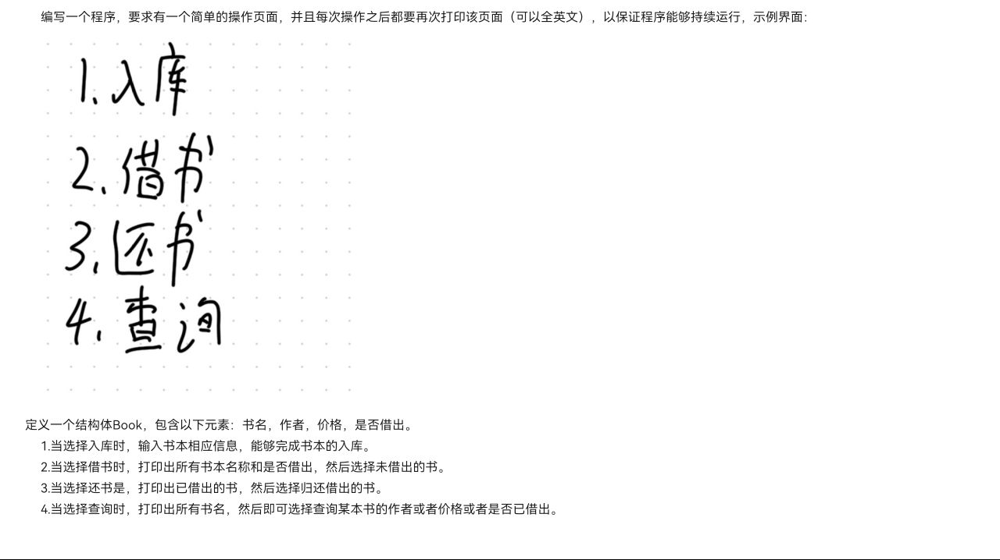

# 第四次考核

## 考核主要知识点

**C++语言基础语法：结构体,类**

## 评判标准
1. **程序能否正确运行出要求的结果**

1. **变量命名是否清晰，书写是否工整有条理**

1. **注释是否完整。（不要求每一行都要有注释，关键变量判断，算式都要有注释）**

***提交时把工程文件和输出结果[图片 ](图片)一起提交，无需写前端界面，在终端输出即可***

### 考核内容

