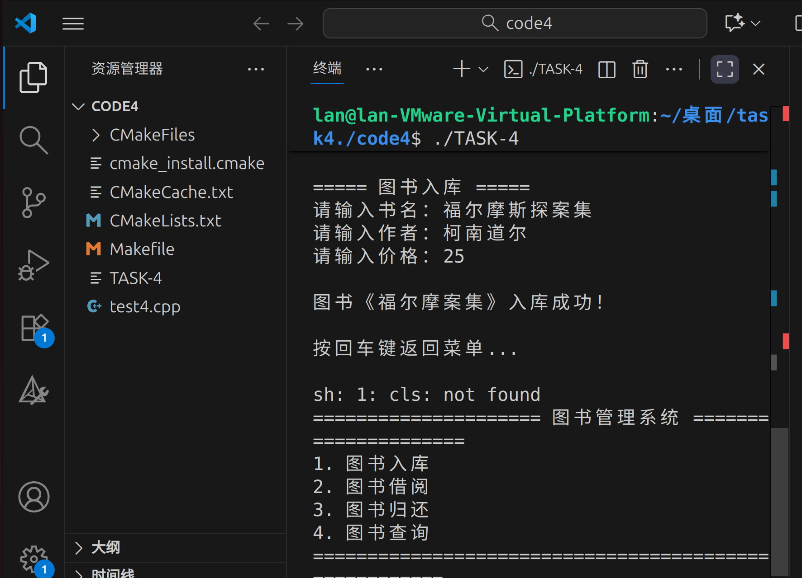

# 第四次考核：图书管理系统

## 考核知识点
C++语言基础语法：结构体、类

## 程序功能说明
实现一个简单的图书管理系统，支持以下功能：
1. 图书入库：添加新图书信息（书名、作者、价格）
2. 图书借阅：查询可借图书并修改借阅状态
3. 图书归还：查询已借图书并修改归还状态
4. 图书查询：查看图书详情（作者、价格、借阅状态）

## 运行结果展示
程序运行后的终端界面及操作效果：

## 代码文件
代码文件路径：`代码/task4.cpp`
